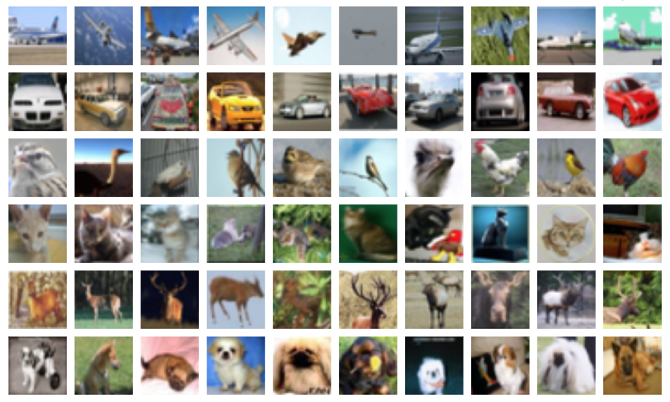

# Image Data Pipelines with Keras and tf.data

Two input pipelines for image classification built with TensorFlow 2 / Keras: `ImageDataGenerator`
on a local LSUN subset, trained with and without data augmentation, and `tf.data` on a CIFAR-100
subset.


## Overview

This project is about how images get into a network. A small CNN is trained on two datasets, each
one fed by a different tool: the `ImageDataGenerator` class from `tf.keras`, which reads images
from folders and can augment them on the fly, and the `tf.data` module, which builds the pipeline
as a chain of transformations (`filter`, `map`, `batch`, `shuffle`) over a `Dataset` object.

On the LSUN scenes, data augmentation reduces overfitting: the gap between training and
validation accuracy drops from about 28 points to about 7, and validation accuracy goes from
66.7% to **72.5%**. On the CIFAR-100 subset, the `tf.data` pipeline feeds a model that reaches
**78.3% accuracy** on the test split with only 5,199 parameters.

Everything lives in a single notebook:
[`tf2-image-data-pipelines-lsun-cifar100.ipynb`](tf2-image-data-pipelines-lsun-cifar100.ipynb)

## Datasets

### LSUN subset (`ImageDataGenerator`)

  

A subset of the [LSUN dataset](https://www.yf.io/p/lsun) with three scene classes, stored in one
folder per class:

|  |  |
|---|---|
| Classes | `church_outdoor`, `classroom`, `conference_room` |
| Training set | 300 images (100 per class) |
| Validation set | 120 images (40 per class) |
| Test set | 300 images (100 per class) |
| Input to the model | 64x64 RGB, pixel values rescaled to `[0, 1]` |
| Task | 3-class image classification |

### CIFAR-100 subset (`tf.data`)



The [CIFAR-100 dataset](https://www.cs.toronto.edu/~kriz/cifar.html) has 100 classes of 32x32 RGB
images. It is downloaded automatically by Keras. Three classes are kept:

|  |  |
|---|---|
| Classes | `apple` (0), `dinosaur` (29), `worm` (99) |
| Training set | 1,500 images (500 per class) |
| Test set | 300 images (100 per class), also used as validation data |
| Input to the model | 32x32 grayscale, pixel values scaled to `[0, 1]` |
| Task | 3-class image classification |

> The LSUN image folders (`data/lsun/train`, `valid` and `test`) are not included in this
> repository. See [Getting started](#getting-started) below.

## Model

The same CNN, built with the functional API, is used for both datasets. Only the input shape
changes. It is compiled with Adam (learning rate 0.0005) and categorical crossentropy.

| Layer | Configuration | Output shape (LSUN) | Params (LSUN) |
|-------|---------------|---------------------|--------------:|
| `Conv2D` | 8 filters 8x8, `padding="same"`, ReLU | (64, 64, 8) | 1,544 |
| `MaxPooling2D` | 2x2 | (32, 32, 8) | 0 |
| `Conv2D` | 4 filters 4x4, `padding="same"`, ReLU | (32, 32, 4) | 516 |
| `MaxPooling2D` | 2x2 | (16, 16, 4) | 0 |
| `Flatten` | - | (1024,) | 0 |
| `Dense` | 16 units, ReLU | (16,) | 16,400 |
| `Dense` | 3 units, softmax | (3,) | 51 |

**18,511 trainable parameters** with the 64x64x3 LSUN input and 5,199 with the 32x32x1 CIFAR-100
input.

Training uses `EarlyStopping` on `val_accuracy` (patience 10) and `ReduceLROnPlateau` (factor 0.5,
minimum learning rate 0.0001) for up to 50 epochs on LSUN, and 15 epochs without callbacks on
CIFAR-100. Batch size is 20 for LSUN and 10 for CIFAR-100.

## Workflow

1. **LSUN generators**: `ImageDataGenerator` with rescaling, reading batches from the class
   folders at 64x64.
2. **Baseline**: train the CNN without augmentation.
3. **Data augmentation**: add rotations (up to 30 degrees), brightness changes (0.5 to 1.5) and
   horizontal flips, and train a new model with the same architecture.
4. **Predictions**: class probabilities of the augmented model on test images.
5. **CIFAR-100 with `tf.data`**: create the `Dataset`, `filter` the 3 classes, `map` the labels to
   one-hot vectors and the images to scaled grayscale, then `batch` and `shuffle`.
6. **CIFAR-100 training and predictions**: train the CNN on the 32x32x1 images and compare true
   and predicted classes on test images.

## Results

| Run | Epochs | Train accuracy | Val accuracy | Best val accuracy | Val loss |
|-----|-------:|---------------:|-------------:|------------------:|---------:|
| LSUN, no augmentation | 30 | 94.33% | 66.67% | 69.17% | 0.847 |
| LSUN, with augmentation | 35 | 79.33% | **72.50%** | 72.50% | 0.770 |
| CIFAR-100 subset (`tf.data`) | 15 | 84.07% | **78.33%** | 78.67% | 0.528 |

Train and validation values are from the last epoch of each run. Both LSUN runs were stopped by
`EarlyStopping` (best epoch 20 and 25 respectively). For three balanced classes, guessing at random
gives 33.3%.

On a sample of 10 CIFAR-100 test images the model gets 9 right, the only mistake being a dinosaur
predicted as a worm. On a sample of 4 LSUN test images the augmented model gets 2 right, with low
confidence in most predictions.

## Key takeaways

- **Few images lead to overfitting.** With 300 training images, the baseline reaches 94% training
  accuracy while its validation accuracy stays around 67% and its validation loss rises after
  epoch 7.
- **Data augmentation helps.** The training-validation accuracy gap goes from about 28 points to
  about 7, and validation accuracy improves by almost 6 points with the same model. Training is
  noisier and training accuracy is lower, as expected.
- **LSUN scenes are hard for a tiny CNN.** `classroom` and `conference_room` share tables, chairs
  and people, and the model is often unsure about them. It can also be confidently wrong, like an
  overexposed conference room labelled as a church with about 90% probability.
- **`tf.data` makes preprocessing explicit.** Filtering classes, one-hot encoding, grayscale
  conversion, batching and shuffling are a handful of lines chained over the dataset.

## Limitations

- In the augmented run, the validation set is also augmented, so it is not strictly comparable
  with the baseline.
- No accuracy over the full LSUN test set was computed, only a visual check of a few images.
- The CIFAR-100 test split is used as validation data, so there is no independent test set for
  that model.
- Each configuration was run once, and with validation sets of 120 and 300 images a difference of
  a few points can be noise.
- In the `tf.data` pipeline `shuffle` is applied after `batch`, so only the order of the batches
  is shuffled.

## Project structure

```
.
├── data/
│   ├── cifar100/                          # Sample image and class names
│   └── lsun/                              # Sample images (train/valid/test folders not tracked)
├── src/tf2_image_data_pipelines_lsun_cifar100/ # Package scaffold
├── tf2-image-data-pipelines-lsun-cifar100.ipynb # Main notebook
└── pyproject.toml                         # Dependencies (uv project)
```

## Getting started

The project is managed with [uv](https://docs.astral.sh/uv/) and requires Python 3.11+.

```bash
# Clone the repository
git clone https://github.com/ramirezgrosas/tf2-image-data-pipelines-lsun-cifar100.git
cd tf2-image-data-pipelines-lsun-cifar100

# Create the virtual environment and install the dependencies
uv sync
```

CIFAR-100 is downloaded automatically by Keras the first time the notebook runs. The LSUN image
folders are not included in the repo. Get a subset of the [LSUN dataset](https://www.yf.io/p/lsun)
with the three classes and arrange it with one subfolder per class (the notebook used 100, 40 and
100 images per class for training, validation and test):

```
data/lsun/train/{church_outdoor,classroom,conference_room}/
data/lsun/valid/{church_outdoor,classroom,conference_room}/
data/lsun/test/{church_outdoor,classroom,conference_room}/
```

Then open the notebook in VS Code and select `.venv` as the kernel, or launch Jupyter directly:

```bash
uv run --with jupyter jupyter lab
```

Main dependencies: TensorFlow 2.21 (Keras 3.15), NumPy and Matplotlib.

## Possible improvements

- Evaluate on the full LSUN test set with `model.evaluate`, using a generator without augmentation.
- Use a non-augmented validation generator to compare the baseline and the augmented model fairly.
- Use `restore_best_weights=True` in `EarlyStopping` to keep the best epoch and not the last one.
- Add `Dropout`, more filters or a deeper network, or try transfer learning for the LSUN scenes.
- Call `shuffle` before `batch` in the `tf.data` pipeline and take a validation split from the
  CIFAR-100 training data.
- Add `cache()` and `prefetch()` to the `tf.data` pipeline.

## Author

**Diego Ramírez Rosas** — [ramirezgrosas](https://github.com/ramirezgrosas)
